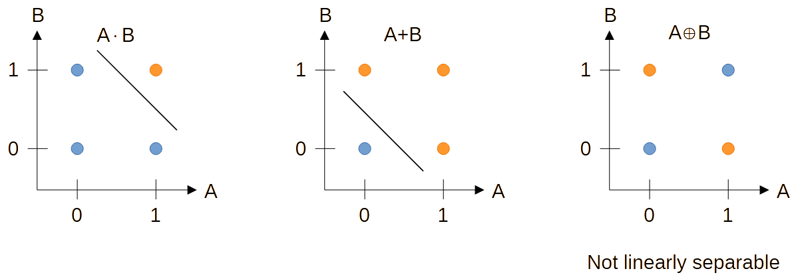
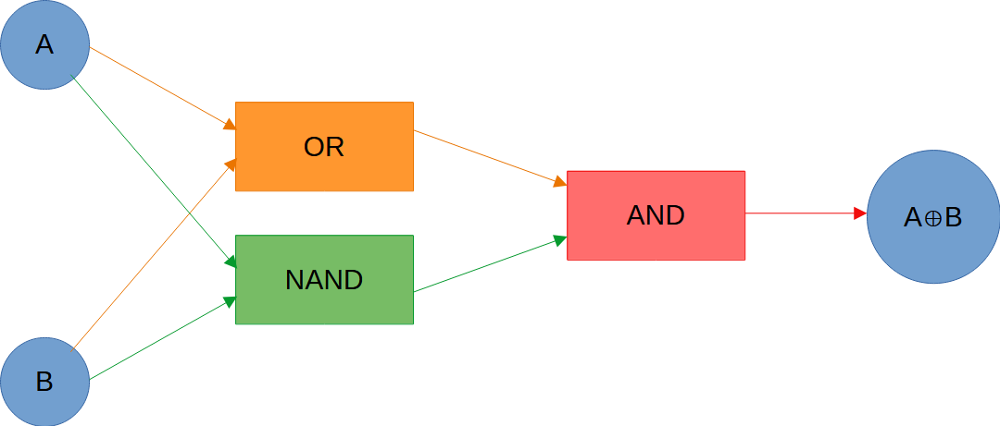

# ann-xor-logic-gate-training
This endeavors to implement the training of an XOR logic gate using artificial neural networks

# Problems using a single multi-layered perceptron in training XOR logic gates
Unlike OR and AND logic gates, a XOR logic gate is not linearly separable.

However, boolean algebra tells us that the XOR logic gate can be deconstructed to a combination of OR and AND logic gates:

$$A\oplus B=(A+B)\cdot\overline{AB}$$

While the XOR logic gate may not be implemented by single multi-layer perceptron (MLP), chaining multiple MLPs would work. This can also be inferred from the use of two separation lines on the plots shown above.
